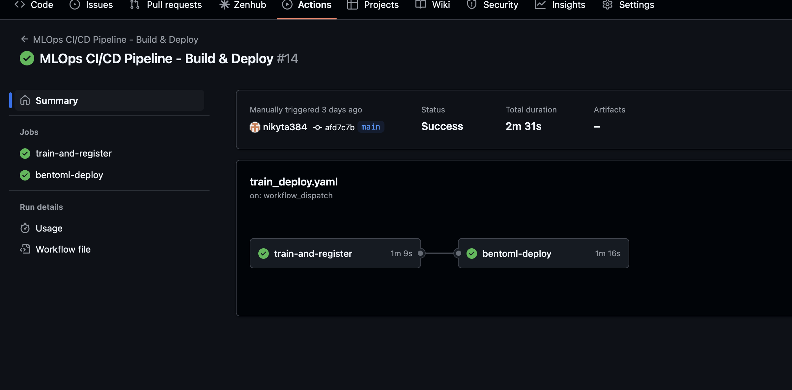
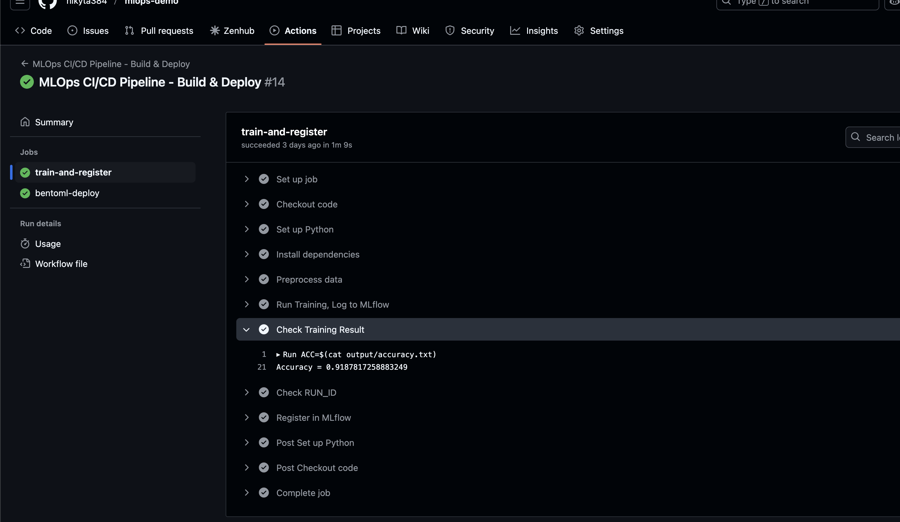
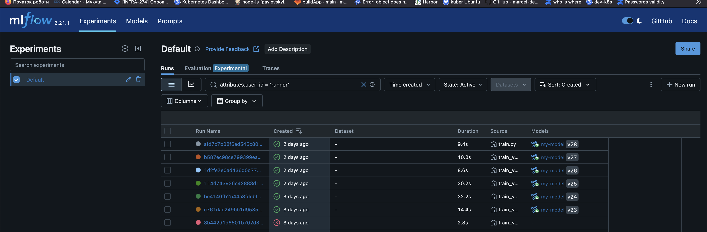
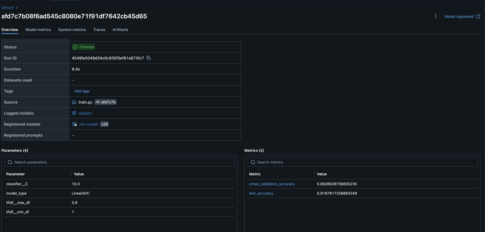
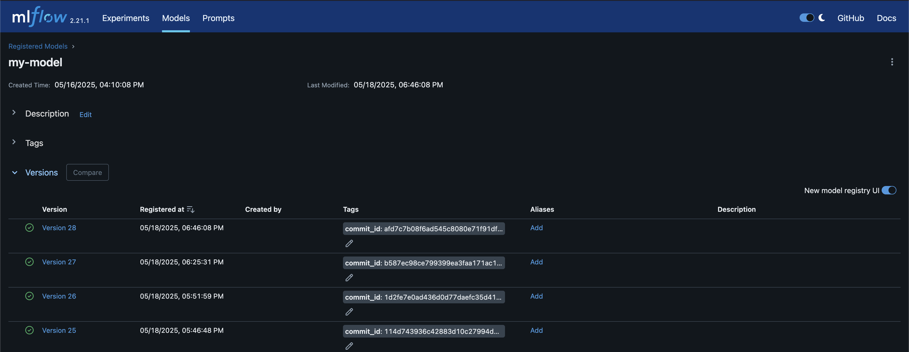
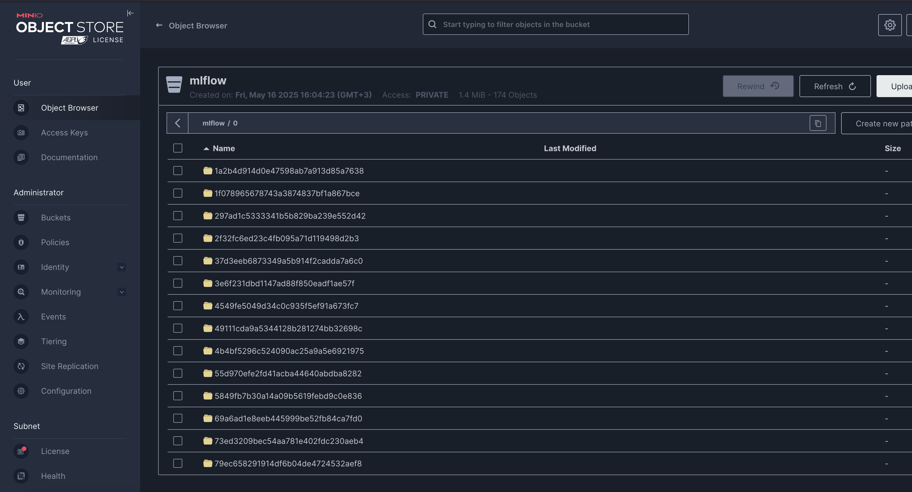
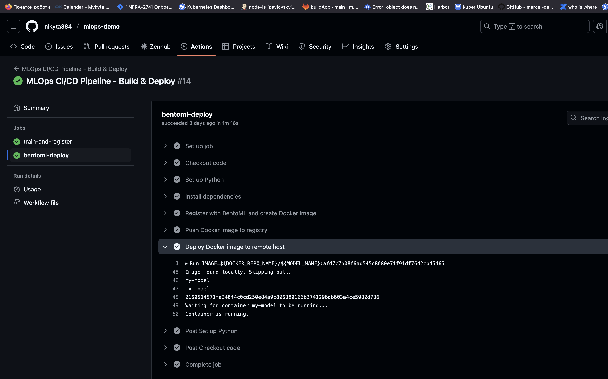
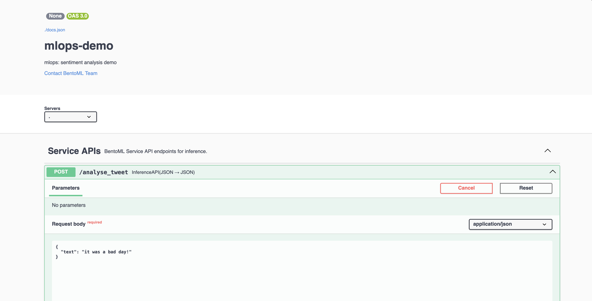
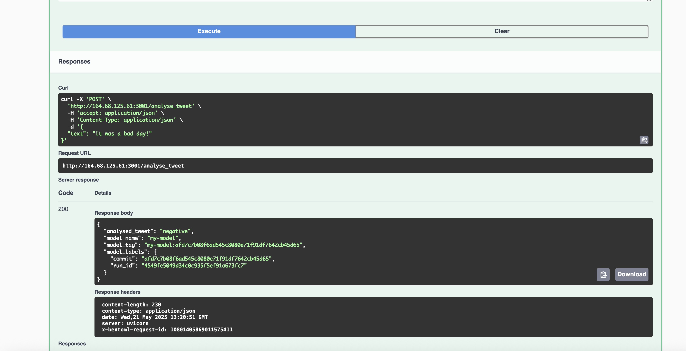

# MLOps-demo

A demo project for an end-to-end MLOps pipeline for Sentiment Analysis using MLflow, BentoML, and MinIO. The pipeline automates data preprocessing, training, model registration, Docker image creation, and deployment via GitHub Actions.

## Project Highlights

- Sentiment analysis model trained on tweet datasets.
- CI/CD pipeline triggers on `main` branch pushes and manual dispatch via GitHub Actions.
- Uses MLflow for experiment tracking and model registry.
- Stores artifacts in MinIO S3-compatible storage.
- Uses BentoML for packaging models and serving predictions.
- Dockerized model deployment with automated container build and push.
- Deployment with Docker support.

## GitHub Actions Pipelines

Defined workflows:

- **train_deploy.yaml** - Full pipeline including:
  - Data preprocessing
  - Model training logged to MLflow with tracking URI configured
  - Accuracy check and conditional model registration if accuracy > 0.85
  - BentoML service build and Docker image creation
  - Docker image push to registry
  - Deployment of Docker container to remote host (self-hosted runner)

## Project Structure Overview

- `src/` - Source code including preprocessing, training, model registration, BentoML registration, and service definition.
- `.github/workflows/` - GitHub CI/CD workflow YAML files.
- `infrastructure/` - Deployment configurations and Ansible playbooks for MinIO and MLflow servers.
- `service.py` - BentoML service for inference.
- `requirements.txt` - Python dependencies.

## Infrastructure

- **MinIO** configured via Docker Compose and Ansible for S3 artifact store.
- **MLflow** server with MySQL backend deployed via Docker Compose and Ansible.

## How To Use

1. **Prepare data**: Place raw tweet sentiment CSV (e.g., `src/dataset/tweet_sentiment.csv`). The preprocessing script (`src/preprocess.py`) cleans and deduplicates data.

2. **Trigger CI/CD pipeline**: Push changes to `main` branch or manually trigger workflows on GitHub.

*GitHub Actions workflow running the CI/CD pipeline.*

3. **Training**: Pipeline trains a sentiment model, logs to MLflow, and saves outputs (accuracy, run ID).

*Accuracy metric output from the training job in GitHub Actions logs.*

4. **Model registration**: If test set accuracy > 0.85, the model is registered in MLflow registry and saved with BentoML.

*MLflow UI showing registered experiments.*

*Metrics (e.g., accuracy) logged for training runs inside MLflow.*

*Registered models in the MLflow Model Registry.*

*MinIO browser showing MLflow stored artifacts like model files.*

5. **Deployment**: BentoML builds and containerizes the model; Docker image pushed and run on remote host.

*Confirmation of deployed Docker container running the BentoML service.*

*Example request and response from the deployed BentoML prediction API.*

*Example request and response from the deployed BentoML prediction API.*

---
